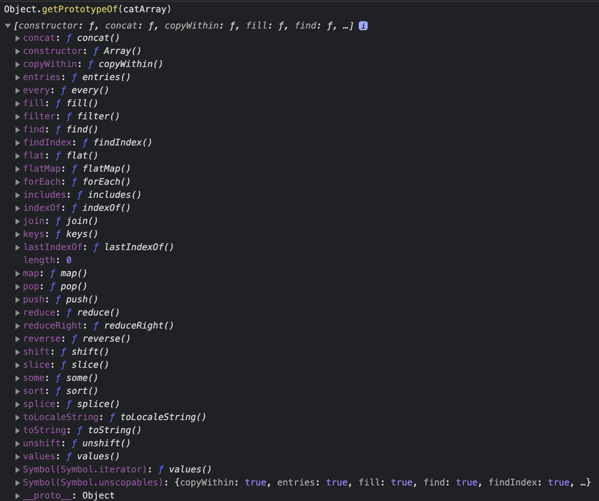
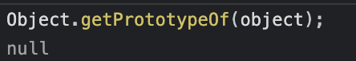
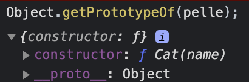

## 🗃️Javascript og objektet

Objektene i javascript er i praksis lik datastrukturen ordbok (🙈 dictionary). Javascript har vel egentlig ingen
formening om klasser slik klassiske objektorienterte språk har. Joda.. vi har selvfølgelig nøkkelordet `class` og uteseendet 
på det som kommer etter, men _egentlig_ så er jo dette bare syntaktisk sukker 💏 som skjuler litt av virkeligheten. 

Javascript er 
prototypisk, slik at klassen er ikke en klasse slik som i klassisk OOP: en oppskrift på hva et objekt er, men mer som en levende ting
som det nye objektet har en link til, eller en relasjon med. Prototypen kan påvirke tilstanden til andre objekter og lever i beste 
velgående når programmet kjører og kan både få nye og bli fratatt gamle metoder. 

Den levende modellen blir liggende bak i prototypekjeden.

<br />

## ❓ Hva er en prototypekjede

 _Prototype Chain.. prototypekjede.. jeg prøver meg.._ 😺

 Når du f.eks lager objekter eller arrays _(lister? matriser? hva blir egentlig ett godt
 norks ord for det?)_ i Javascript, så delegeres oppførselen fra prototypen. Den arver på en måte
 det som trengs:

 ```javascript
 const catArray = ['Pelle Katt', 'Pusur', 'Tom'];
 ```

og så kjører du `Object.getPrototypeOf(catArray)`:
 

Lots of goodies.

Prototypekjeden er altså slik vi får til arv i Javascript. Vi bygger nye objekt basert på gamle. PÅ den måten kan vi ordne til
noe OOP-lignende greier. Du når, som du ser, prototypen via `Object.getPrototypeOf(objektetDuVilSjekkeUt)`, eller evt. `objektetDuVilSjekkeUt.__proto__`.
<br />


<br />
<br />

## 🏗️ Lage objekter i Javascript

<br />

### 1️⃣ Object constructor:

Trenger vel ikke si så mye?

```javascript
  var object = new Object();
```

<br />


### 2️⃣ `create` meteoden på `Object`:

Her kan du også f.eks lage et objekt uten en prototype (altså uten å linke til `Object.prototype`)

```javascript
  var object = Object.create(null);
```



<br />

### 3️⃣ Object literal, bokstavelig talt:

```javascript
  var object = {};
```

<br />

### 4️⃣ Med `new` operatøren:

Dette er i hovedsak det `class` gjør i bakkanten.

```javascript
function Cat(name) {
   this.name = name;
   this.sound = function () {
      console.log('mjau');
   }
}

const pelle = new Cat("Pelle");
```

Hvis vi kjører `Object.getPrototypeOf(catObj);` nå:



For å bygge litt videre på den med prototypekjeden og levende objekter i kjøretiden og så videre:

```javascript
Cat.prototype.claws = true;
```

ville ført til at `pelle` også fikk denne propertien.

<br />

### 5️⃣ Med `class' syntaksen

Denne kom i ES6 og ligner på det man kjenner igjen fra den tradisjonelle objektorienterte programmeringen med klasser som en oppskrift.

```javascript
class Cat {
    constructor(name) {
        this.name = name;
        this.sound = function () {
            console.log('mjau');
        };
    }
}

const pelle = new Cat("Pelle");
```

Den er, som du nå vet, helt lik 4️⃣ 😎
<br />
<br />
<br />
<br />
